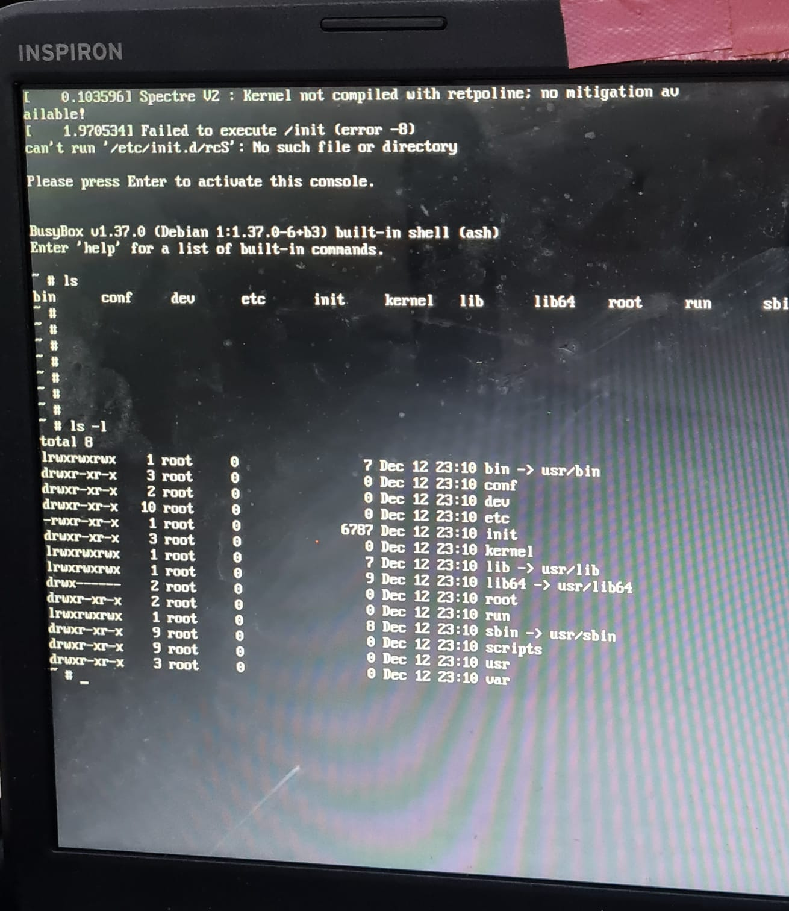

# Linux-kernel-compilation
Insane/Impossible/Hard Project for "Operating systems" course in Taif university.

Creating and compiling new custom linux kernel.

All commands already here on this [Shell script](script.sh)

## Results
New kernel size is `2.8 MB` .

### Thanks for :
- [Yasser Alharthi](https://github.com/YR-XQ)
- Mohammad Alharthi
- Faris Althaqafi
- Khalid Al-borai
- Mohammad Alzahrani

### Problems LOL

|                    |                    |                    |
| ------------------ | ------------------ | ------------------ |
|   |   |   |
|   |   |   |
|   |   |   |
|  |  |  |                   |             

