# Linux-kernel-compilation
Final Project for "Operating systems" course in Taif university.

Creating and compiling new custom linux kernel.

All commands already here on this Shell script :

``
#!/bin/bash
# Linux Kernel Compilation Script (Debian)
# Purpose: Compile and install a custom Linux kernel

set -e 

echo "Installing required packages"
sudo apt update
sudo apt install -y build-essential libncurses-dev bison flex libssl-dev libelf-dev bc

echo "Downloading kernel source"
cd ~
wget https://cdn.kernel.org/pub/linux/kernel/v6.x/linux-6.1.69.tar.xz
tar -xf linux-6.1.69.tar.xz
cd linux-6.1.69

echo "Loading current kernel config"
cp /boot/config-$(uname -r) .config

echo "Updating configuration"
make oldconfig

echo "Compiling kernel (using 1 core for stability)"
make -j2

sudo make modules_install

sudo make install

echo "Updating GRUB"
sudo update-grub

echo "Done!"

# sudo reboot
echo "write sudo reboot to rebooting system and using new kernel"

``

## Results
New kernel size is `2.8 MB` .

### Thanks for :
- سعد سعيد المالكي 44254198
- محمد عبدالله الحارثي 44209888
- محمد عبدالله بخيت الزهراني 44252647
- فارس الثقفي 44450531
- خالد الساقله 44254937
- ياسر مرزوق الحارثي 44251696
- عبد الله الشهري 44451978

### Images

|                    |                    |                    |
| ------------------ | ------------------ | ------------------ |
| 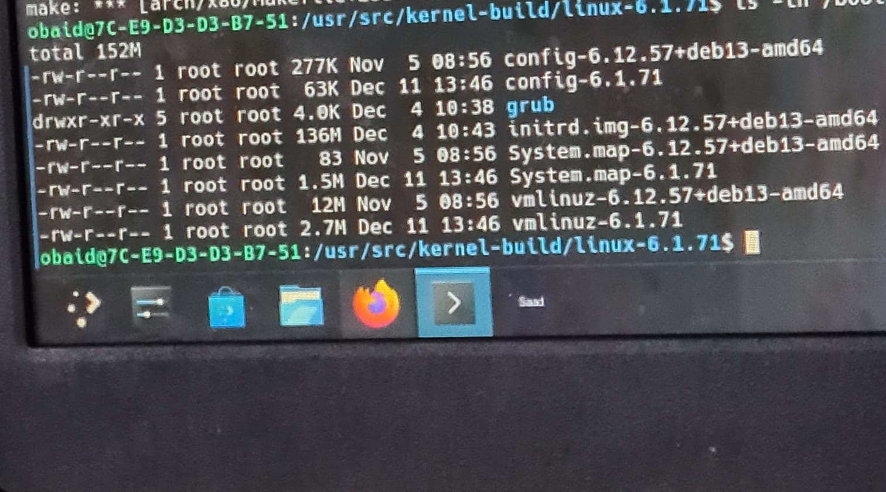  | 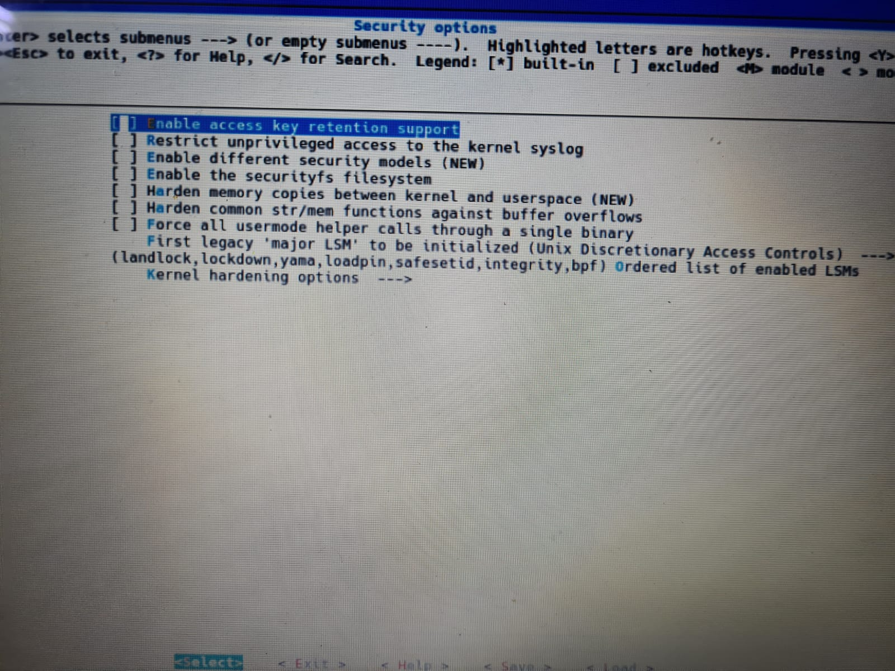  | 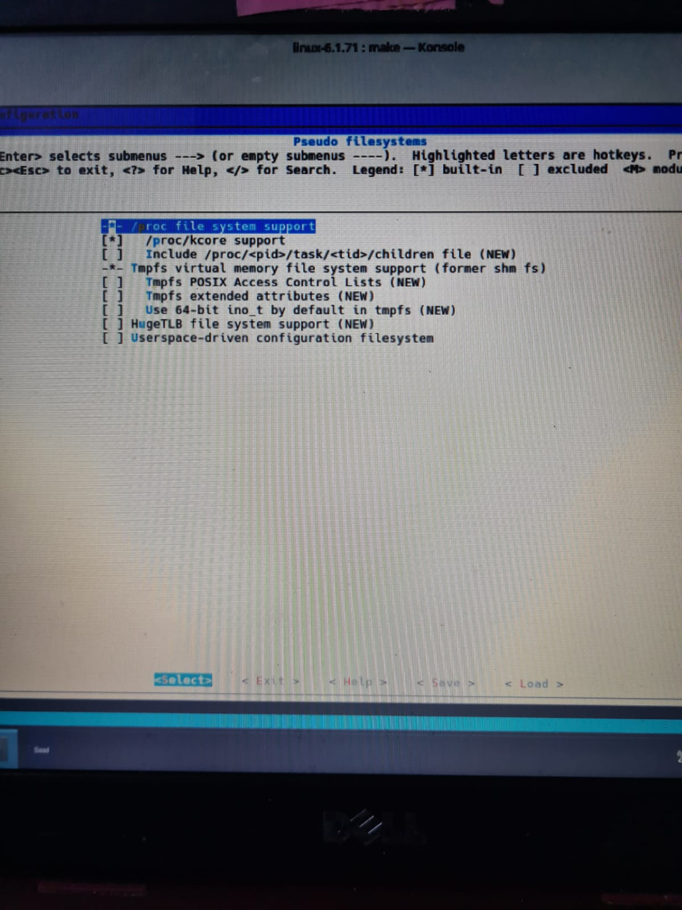  |
| 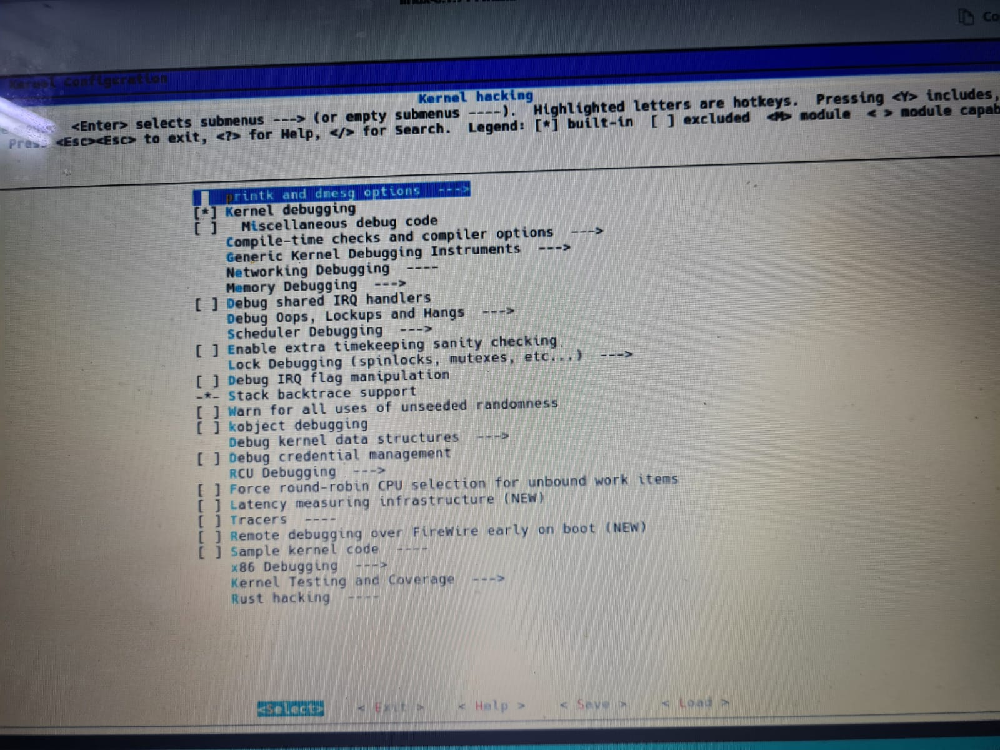  | 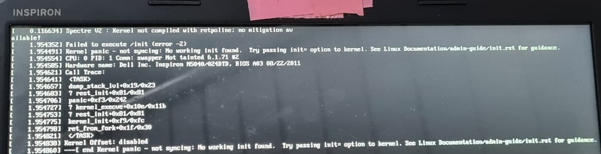  | 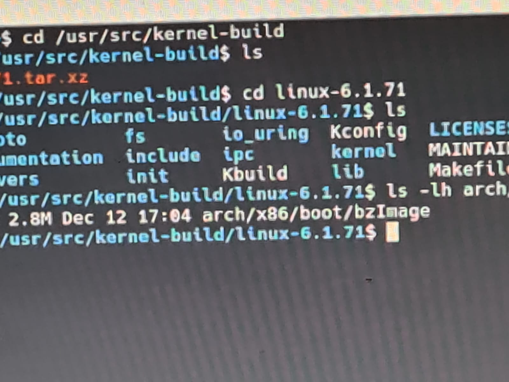  |
| 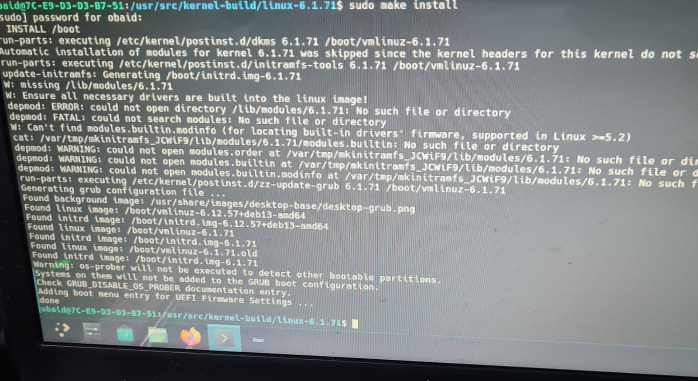  | 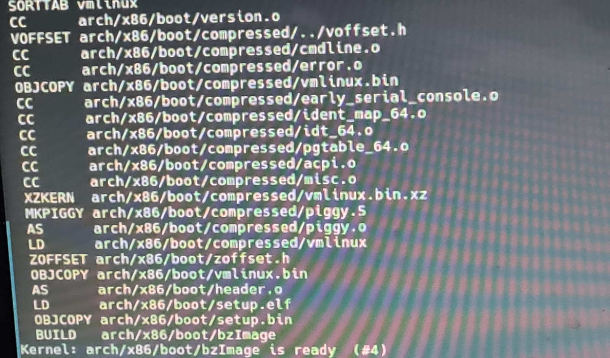  | 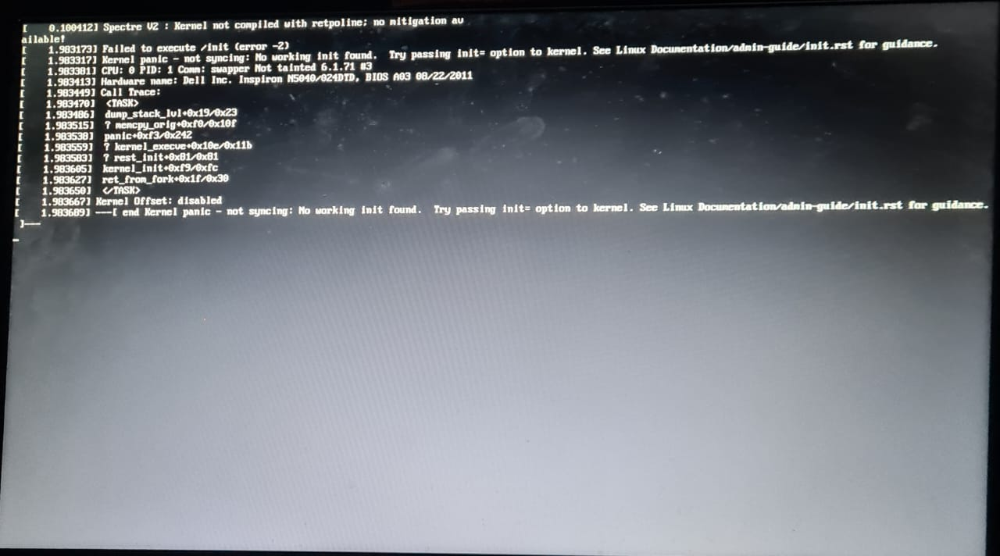  |
| 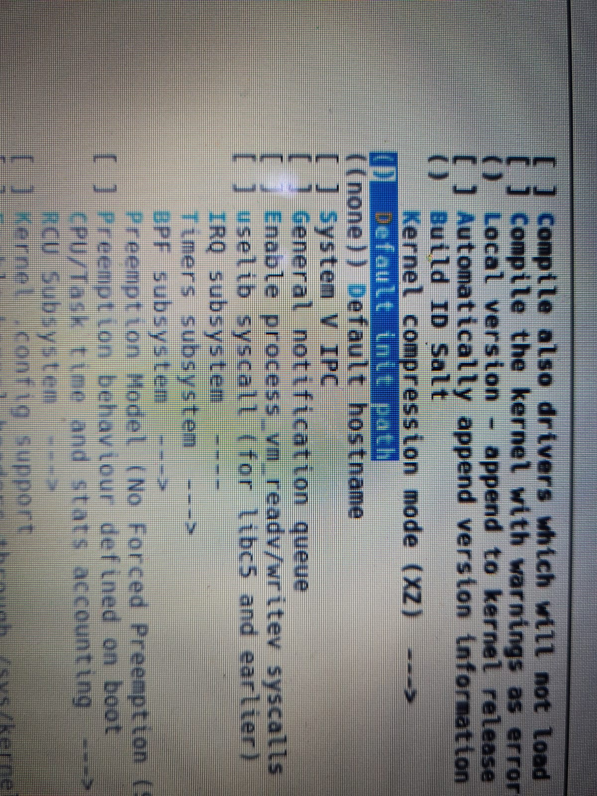 | 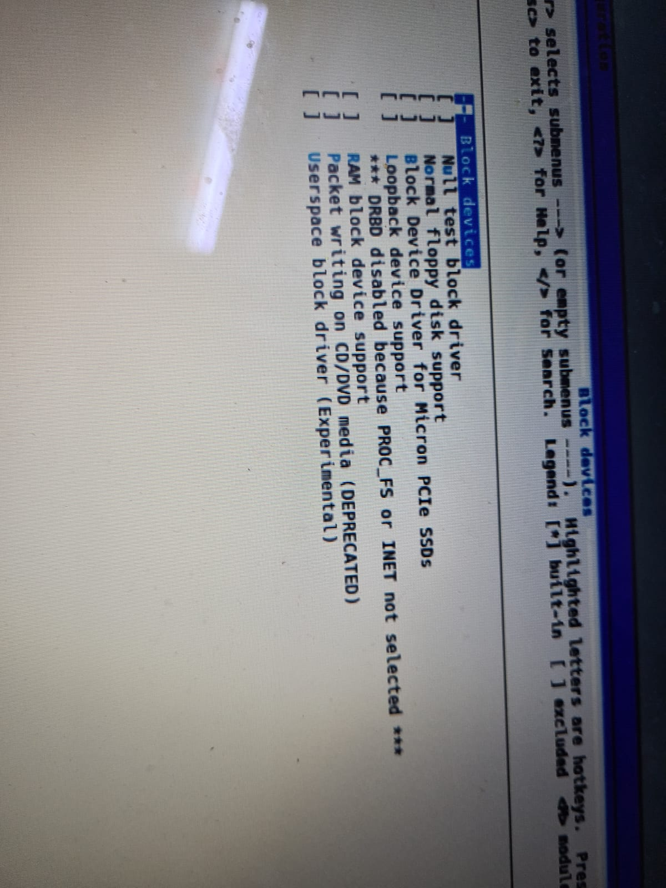 | 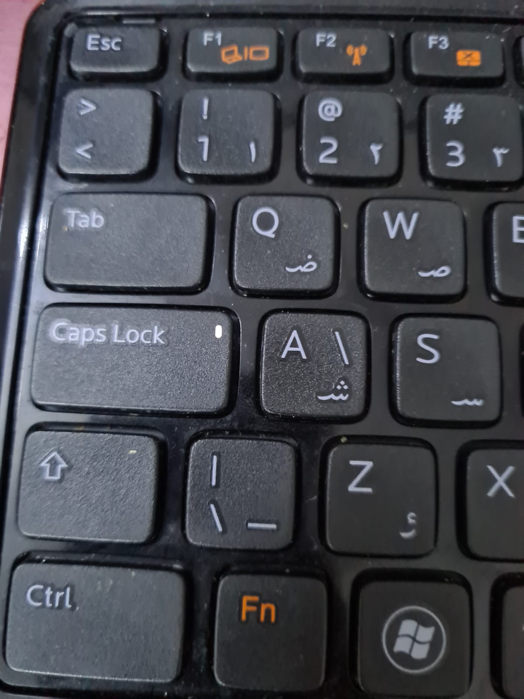 |                   |             

